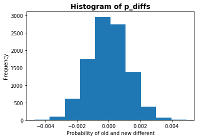
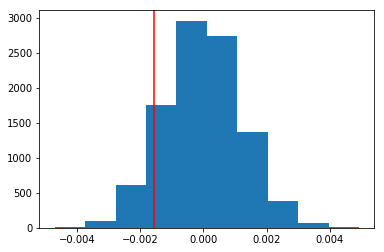

### Introduction
- A/B tests are very commonly performed by data analysts and data scientists.  It is important that you get some practice working with the difficulties of these 
- For this project, you will be working to understand the results of an A/B test run by an e-commerce website.  Your goal is to work through this notebook to help the company understand if they should implement the new page, keep the old page, or perhaps run the experiment longer to make their decision.

## Table of Contents
- [Part I - Probability](#probability)
- [Part II - A/B Test](#ab_test)
- [Part III - Regression](#regression)

<a id='probability'></a>
#### Part I - Probability

To get started, let's import our libraries.


```python
import pandas as pd
import numpy as np
import random
import matplotlib.pyplot as plt
%matplotlib inline
#We are setting the seed to assure you get the same answers on quizzes as we set up
random.seed(42)
```

`1.` Now, read in the `ab_data.csv` data. Store it in `df`.  **Use your dataframe to answer the questions in Quiz 1 of the classroom.**

a. Read in the dataset and take a look at the top few rows here:


```python
df = pd.read_csv('ab_data.csv')
```

b. Use the cell below to find the number of rows in the dataset.


```python
df.shape[0]
```


    294478


c. The number of unique users in the dataset.


```python
df['user_id'].nunique()
```


    290584


d. The proportion of users converted.


```python
df['converted'].sum() / df['user_id'].nunique()
```


    0.12126269856564711


e. The number of times the `new_page` and `treatment` don't match.


```python
temp1 = df[(df['group'] == 'control') & (df['landing_page'] == 'new_page')].shape[0]
temp2 = df[(df['group'] == 'treatment') & (df['landing_page'] == 'old_page')].shape[0]
dont_match = temp1+temp2
print(dont_match)
```

    3893
    

f. Do any of the rows have missing values?


```python
df.isnull().sum()
## There is no missing value in this data set
```


    user_id         0
    timestamp       0
    group           0
    landing_page    0
    converted       0
    dtype: int64


`2.` For the rows where **treatment** does not match with **new_page** or **control** does not match with **old_page**, we cannot be sure if this row truly received the new or old page.  Use **Quiz 2** in the classroom to figure out how we should handle these rows.  

a. Now use the answer to the quiz to create a new dataset that meets the specifications from the quiz.  Store your new dataframe in **df2**.


```python
df2 = df.query("group == 'control' and landing_page == 'old_page'")
df2 = df2.append(df.query("group == 'treatment' and landing_page == 'new_page'"))
```


```python
# Double Check all of the correct rows were removed - this should be 0
df2[((df2['group'] == 'treatment') == (df2['landing_page'] == 'new_page')) == False].shape[0]
```


    0


`3.` Use **df2** and the cells below to answer questions for **Quiz3** in the classroom.

a. How many unique **user_id**s are in **df2**?


```python
df2['user_id'].nunique()
```


    290584


b. There is one **user_id** repeated in **df2**.  What is it?


```python
df2[df2['user_id'].duplicated()]
```


<div>
<style scoped>
    .dataframe tbody tr th:only-of-type {
        vertical-align: middle;
    }

    .dataframe tbody tr th {
        vertical-align: top;
    }

    .dataframe thead th {
        text-align: right;
    }
</style>
<table border="1" class="dataframe">
  <thead>
    <tr style="text-align: right;">
      <th></th>
      <th>user_id</th>
      <th>timestamp</th>
      <th>group</th>
      <th>landing_page</th>
      <th>converted</th>
    </tr>
  </thead>
  <tbody>
    <tr>
      <th>2893</th>
      <td>773192</td>
      <td>2017-01-14 02:55:59.590927</td>
      <td>treatment</td>
      <td>new_page</td>
      <td>0</td>
    </tr>
  </tbody>
</table>
</div>


c. What is the row information for the repeat **user_id**? 


```python
df2[df2['user_id'] == 773192]
```


<div>
<style scoped>
    .dataframe tbody tr th:only-of-type {
        vertical-align: middle;
    }

    .dataframe tbody tr th {
        vertical-align: top;
    }

    .dataframe thead th {
        text-align: right;
    }
</style>
<table border="1" class="dataframe">
  <thead>
    <tr style="text-align: right;">
      <th></th>
      <th>user_id</th>
      <th>timestamp</th>
      <th>group</th>
      <th>landing_page</th>
      <th>converted</th>
    </tr>
  </thead>
  <tbody>
    <tr>
      <th>1899</th>
      <td>773192</td>
      <td>2017-01-09 05:37:58.781806</td>
      <td>treatment</td>
      <td>new_page</td>
      <td>0</td>
    </tr>
    <tr>
      <th>2893</th>
      <td>773192</td>
      <td>2017-01-14 02:55:59.590927</td>
      <td>treatment</td>
      <td>new_page</td>
      <td>0</td>
    </tr>
  </tbody>
</table>
</div>


d. Remove **one** of the rows with a duplicate **user_id**, but keep your dataframe as **df2**.


```python
df2.drop(2893, inplace=True)

## Checking
df2[df2['user_id']==773192]
```


<div>
<style scoped>
    .dataframe tbody tr th:only-of-type {
        vertical-align: middle;
    }

    .dataframe tbody tr th {
        vertical-align: top;
    }

    .dataframe thead th {
        text-align: right;
    }
</style>
<table border="1" class="dataframe">
  <thead>
    <tr style="text-align: right;">
      <th></th>
      <th>user_id</th>
      <th>timestamp</th>
      <th>group</th>
      <th>landing_page</th>
      <th>converted</th>
    </tr>
  </thead>
  <tbody>
    <tr>
      <th>1899</th>
      <td>773192</td>
      <td>2017-01-09 05:37:58.781806</td>
      <td>treatment</td>
      <td>new_page</td>
      <td>0</td>
    </tr>
  </tbody>
</table>
</div>


`4.` Use **df2** in the cells below to answer the quiz questions related to **Quiz 4** in the classroom.

a. What is the probability of an individual converting regardless of the page they receive?


```python
df2['converted'].mean()
```


    0.11959708724499628


b. Given that an individual was in the `control` group, what is the probability they converted?


```python
control_convert = df2[df2['group']=='control']['converted'].mean()
control_convert
```


    0.1203863045004612


c. Given that an individual was in the `treatment` group, what is the probability they converted?


```python
treatment_convert = df2[df2['group']=='treatment']['converted'].mean()
treatment_convert
```


    0.11880806551510564


d. What is the probability that an individual received the new page?


```python
num_newpage = len(df2.query("landing_page == 'new_page' "))
total = len(df2.index)

print(float(num_newpage/total))
```

    0.5000619442226688
    

e. Consider your results from parts (a) through (d) above, and explain below whether you think there is sufficient evidence to conclude that the new treatment page leads to more conversions.

**While comparing probability of converted given group (treatment / control), the probability of being converted given control group is slightly higher than the probability of being converted given treatment group. What is more, the probability of an individual received the page is 0.5, which is pretty fair. For all of the reasons above, it is hard to conclude which page lead more to conversion**

<a id='ab_test'></a>
### Part II - A/B Test

Notice that because of the time stamp associated with each event, you could technically run a hypothesis test continuously as each observation was observed.  

However, then the hard question is do you stop as soon as one page is considered significantly better than another or does it need to happen consistently for a certain amount of time?  How long do you run to render a decision that neither page is better than another?  

These questions are the difficult parts associated with A/B tests in general.  


`1.` For now, consider you need to make the decision just based on all the data provided.  If you want to assume that the old page is better unless the new page proves to be definitely better at a Type I error rate of 5%, what should your null and alternative hypotheses be?  You can state your hypothesis in terms of words or in terms of **$p_{old}$** and **$p_{new}$**, which are the converted rates for the old and new pages.

**Null Hypothesis $H_{0}$: $p_{old}$ <= $p_{new}$** 

**Alternative Hypothesis $H_{a}$: $p_{new}$ > $p_{old}$**

`2.` Assume under the null hypothesis, $p_{new}$ and $p_{old}$ both have "true" success rates equal to the **converted** success rate regardless of page - that is $p_{new}$ and $p_{old}$ are equal. Furthermore, assume they are equal to the **converted** rate in **ab_data.csv** regardless of the page. <br><br>

Use a sample size for each page equal to the ones in **ab_data.csv**.  <br><br>

Perform the sampling distribution for the difference in **converted** between the two pages over 10,000 iterations of calculating an estimate from the null.  <br><br>

Use the cells below to provide the necessary parts of this simulation.  If this doesn't make complete sense right now, don't worry - you are going to work through the problems below to complete this problem.  You can use **Quiz 5** in the classroom to make sure you are on the right track.<br><br>

a. What is the **conversion rate** for $p_{new}$ under the null? 


```python
p_new = df2['converted'].mean()
p_new
```


    0.11959708724499628


b. What is the **conversion rate** for $p_{old}$ under the null? <br><br>


```python
p_old = df2['converted'].mean()
p_old
```


    0.11959708724499628


c. What is $n_{new}$, the number of individuals in the treatment group?


```python
n_new = df2.query("landing_page == 'new_page'").shape[0]
n_new
```


    145310


d. What is $n_{old}$, the number of individuals in the control group?


```python
n_old = df2.query("landing_page == 'old_page'").shape[0]
n_old
```


    145274


e. Simulate $n_{new}$ transactions with a conversion rate of $p_{new}$ under the null.  Store these $n_{new}$ 1's and 0's in **new_page_converted**.


```python
new_page_converted = np.random.binomial(1, p_new, n_new)
new_page_converted
```


    array([0, 0, 0, ..., 0, 0, 0])


f. Simulate $n_{old}$ transactions with a conversion rate of $p_{old}$ under the null.  Store these $n_{old}$ 1's and 0's in **old_page_converted**.


```python
old_page_converted = np.random.binomial(1, p_old, n_old)
old_page_converted
```


    array([0, 0, 0, ..., 1, 0, 0])


g. Find $p_{new}$ - $p_{old}$ for your simulated values from part (e) and (f).


```python
new_page_converted.mean() - old_page_converted.mean()
```


    -0.00030512097213337974


h. Create 10,000 $p_{new}$ - $p_{old}$ values using the same simulation process you used in parts (a) through (g) above. Store all 10,000 values in a NumPy array called **p_diffs**.


```python
p_diffs = []
for x in range(10000):
    new_converted = np.random.binomial(1, p_new, n_new).mean()
    old_converted = np.random.binomial(1, p_old, n_old).mean()
    p_diffs.append(new_converted - old_converted)

len(p_diffs)
```


    10000


i. Plot a histogram of the **p_diffs**.  Does this plot look like what you expected?  Use the matching problem in the classroom to assure you fully understand what was computed here.


```python
plt.hist(p_diffs)
plt.title("Histogram of p_diffs", fontsize=14, fontweight='bold')
plt.xlabel("Probability of old and new different")
plt.ylabel("Frequency")
plt.show()
```





j. What proportion of the **p_diffs** are greater than the actual difference observed in **ab_data.csv**?


```python
actual_diff = np.array(treatment_convert - control_convert)
## This is the answer
print((p_diffs > actual_diff).mean()) ## This is p-value
plt.hist(p_diffs)
plt.axvline(x=actual_diff, color='red')
plt.show()
```

    0.8984
    





k. Please explain using the vocabulary you've learned in this course what you just computed in part **j.**  What is this value called in scientific studies?  What does this value mean in terms of whether or not there is a difference between the new and old pages?

**Since the p-value (0.9038), meaning is 90.21% chance of being p_diffs, is larger than the alpha (0.05 or 5%), I fail to reject the null hypothesis since I don't have enough evidence to reject it.**

l. We could also use a built-in to achieve similar results.  Though using the built-in might be easier to code, the above portions are a walkthrough of the ideas that are critical to correctly thinking about statistical significance. Fill in the below to calculate the number of conversions for each page, as well as the number of individuals who received each page. Let `n_old` and `n_new` refer the the number of rows associated with the old page and new pages, respectively.


```python
import statsmodels.api as sm
from scipy import stats

convert_old = df2.query("landing_page == 'old_page'")['converted'].sum()
convert_new = df2.query("landing_page == 'new_page'")['converted'].sum()
n_old = df2.query("landing_page == 'old_page'").shape[0]
n_new = df2.query("landing_page == 'new_page'").shape[0]
```

    /opt/conda/lib/python3.6/site-packages/statsmodels/compat/pandas.py:56: FutureWarning: The pandas.core.datetools module is deprecated and will be removed in a future version. Please use the pandas.tseries module instead.
      from pandas.core import datetools
    

m. Now use `stats.proportions_ztest` to compute your test statistic and p-value.  [Here](https://docs.w3cub.com/statsmodels/generated/statsmodels.stats.proportion.proportions_ztest/) is a helpful link on using the built in.


```python
z_score, p_value = sm.stats.proportions_ztest([convert_old, convert_new], [n_old, n_new])
(z_score, p_value)
```


    (1.3109241984234394, 0.18988337448195103)


n. What do the z-score and p-value you computed in the previous question mean for the conversion rates of the old and new pages?  Do they agree with the findings in parts **j.** and **k.**?

**The z-score show the different between old page and new page conversion rate and my null hypothesis is ~1.31 standard deviation above the mean (Mean is 0). My p-value is 0.189, large different from the above p-value (~0.98). However, the p-value remains larger than the alpha (0.05 or 5%) therefore I again fail to reject my null hypothesis. As conclusion, the previous test and this test appear to both agree with one result that I don't have enough evidence to reject my null hypothesis and I again fail to reject my null hypothesis**

<a id='regression'></a>
### Part III - A regression approach

`1.` In this final part, you will see that the result you achieved in the A/B test in Part II above can also be achieved by performing regression.<br><br> 

a. Since each row is either a conversion or no conversion, what type of regression should you be performing in this case?

**PI should perform a logistic regression since I want to now the odds of conversion**

b. The goal is to use **statsmodels** to fit the regression model you specified in part **a.** to see if there is a significant difference in conversion based on which page a customer receives. However, you first need to create in df2 a column for the intercept, and create a dummy variable column for which page each user received.  Add an **intercept** column, as well as an **ab_page** column, which is 1 when an individual receives the **treatment** and 0 if **control**.


```python
df2['intercept'] = 1
```


```python
#df2[['temp', 'ab_page']] = pd.get_dummies(df2['group'])
#df2.drop('temp', axis=1, inplace=True)
#df2.head()

def check_group(group):
    l = []
    for g in group:
        if (g=='control'):
            l.append(0)
        else:
            l.append(1)
    return l

df2['ab_page'] = check_group(df2['group'])
df2['ab_page'].value_counts()

```


    1    145310
    0    145274
    Name: ab_page, dtype: int64


c. Use **statsmodels** to instantiate your regression model on the two columns you created in part b., then fit the model using the two columns you created in part **b.** to predict whether or not an individual converts. 


```python
import statsmodels.api as sm
logit = sm.Logit(df2['converted'], df2[['intercept', 'ab_page']])
results = logit.fit()
```

    Optimization terminated successfully.
             Current function value: 0.366118
             Iterations 6
    

d. Provide the summary of your model below, and use it as necessary to answer the following questions.


```python
## For some reason, when I do results.summary() it give errors
## AttributeError: module 'scipy.stats' has no attribute 'chisqprob'.
results.summary2()
```


<table class="simpletable">
<tr>
        <td>Model:</td>              <td>Logit</td>       <td>No. Iterations:</td>    <td>6.0000</td>   
</tr>
<tr>
  <td>Dependent Variable:</td>     <td>converted</td>    <td>Pseudo R-squared:</td>    <td>0.000</td>   
</tr>
<tr>
         <td>Date:</td>        <td>2020-06-14 20:52</td>       <td>AIC:</td>        <td>212780.3502</td>
</tr>
<tr>
   <td>No. Observations:</td>       <td>290584</td>            <td>BIC:</td>        <td>212801.5095</td>
</tr>
<tr>
       <td>Df Model:</td>              <td>1</td>         <td>Log-Likelihood:</td>  <td>-1.0639e+05</td>
</tr>
<tr>
     <td>Df Residuals:</td>         <td>290582</td>          <td>LL-Null:</td>      <td>-1.0639e+05</td>
</tr>
<tr>
      <td>Converged:</td>           <td>1.0000</td>           <td>Scale:</td>         <td>1.0000</td>   
</tr>
</table>
<table class="simpletable">
<tr>
      <td></td>       <th>Coef.</th>  <th>Std.Err.</th>     <th>z</th>      <th>P>|z|</th> <th>[0.025</th>  <th>0.975]</th> 
</tr>
<tr>
  <th>intercept</th> <td>-1.9888</td>  <td>0.0081</td>  <td>-246.6690</td> <td>0.0000</td> <td>-2.0046</td> <td>-1.9730</td>
</tr>
<tr>
  <th>ab_page</th>   <td>-0.0150</td>  <td>0.0114</td>   <td>-1.3109</td>  <td>0.1899</td> <td>-0.0374</td> <td>0.0074</td> 
</tr>
</table>


e. What is the p-value associated with **ab_page**? Why does it differ from the value you found in **Part II**?<br><br>  **Hint**: What are the null and alternative hypotheses associated with your regression model, and how do they compare to the null and alternative hypotheses in **Part II**?

**In part II, the found p-value was different from part I. However, the p-value of part III (0.1899) and part II (0.1898) is slightly different. The p-value is still larger than the alpha (0.1899 > 0.05) or (18.99% > 5%). Therefore, I fail to reject the null hypothesis and there is none or not enough evidence to show that usees are more likely to convert page and the new page is either the same or worse efficient than the old page.**

f. Now, you are considering other things that might influence whether or not an individual converts.  Discuss why it is a good idea to consider other factors to add into your regression model.  Are there any disadvantages to adding additional terms into your regression model?

**Up to this point, none of my tests show that whether the treatment or control group has much impact if the user converts paeg. However, nothing is sure yet at this point since Simpson Paradox might reverse our results with other aspect of the user. By looking into more users' aspect, it will help answer the question "Is there any users' information that might influce him/her to do page conversion?" as well as better demonstrate that our results in part I, II, III is right. **

g. Now along with testing if the conversion rate changes for different pages, also add an effect based on which country a user lives in. You will need to read in the **countries.csv** dataset and merge together your datasets on the appropriate rows.  [Here](https://pandas.pydata.org/pandas-docs/stable/generated/pandas.DataFrame.join.html) are the docs for joining tables. 

Does it appear that country had an impact on conversion?  Don't forget to create dummy variables for these country columns - **Hint: You will need two columns for the three dummy variables.** Provide the statistical output as well as a written response to answer this question.


```python
countries_df = pd.read_csv('countries.csv')
countries_df.head()
```


<div>
<style scoped>
    .dataframe tbody tr th:only-of-type {
        vertical-align: middle;
    }

    .dataframe tbody tr th {
        vertical-align: top;
    }

    .dataframe thead th {
        text-align: right;
    }
</style>
<table border="1" class="dataframe">
  <thead>
    <tr style="text-align: right;">
      <th></th>
      <th>user_id</th>
      <th>country</th>
    </tr>
  </thead>
  <tbody>
    <tr>
      <th>0</th>
      <td>834778</td>
      <td>UK</td>
    </tr>
    <tr>
      <th>1</th>
      <td>928468</td>
      <td>US</td>
    </tr>
    <tr>
      <th>2</th>
      <td>822059</td>
      <td>UK</td>
    </tr>
    <tr>
      <th>3</th>
      <td>711597</td>
      <td>UK</td>
    </tr>
    <tr>
      <th>4</th>
      <td>710616</td>
      <td>UK</td>
    </tr>
  </tbody>
</table>
</div>


```python
merged = df2.set_index('user_id').join(countries_df.set_index('user_id'))
merged.head()
```


<div>
<style scoped>
    .dataframe tbody tr th:only-of-type {
        vertical-align: middle;
    }

    .dataframe tbody tr th {
        vertical-align: top;
    }

    .dataframe thead th {
        text-align: right;
    }
</style>
<table border="1" class="dataframe">
  <thead>
    <tr style="text-align: right;">
      <th></th>
      <th>timestamp</th>
      <th>group</th>
      <th>landing_page</th>
      <th>converted</th>
      <th>intercept</th>
      <th>ab-page</th>
      <th>ab_page</th>
      <th>country</th>
    </tr>
    <tr>
      <th>user_id</th>
      <th></th>
      <th></th>
      <th></th>
      <th></th>
      <th></th>
      <th></th>
      <th></th>
      <th></th>
    </tr>
  </thead>
  <tbody>
    <tr>
      <th>851104</th>
      <td>2017-01-21 22:11:48.556739</td>
      <td>control</td>
      <td>old_page</td>
      <td>0</td>
      <td>1</td>
      <td>0</td>
      <td>0</td>
      <td>US</td>
    </tr>
    <tr>
      <th>804228</th>
      <td>2017-01-12 08:01:45.159739</td>
      <td>control</td>
      <td>old_page</td>
      <td>0</td>
      <td>1</td>
      <td>0</td>
      <td>0</td>
      <td>US</td>
    </tr>
    <tr>
      <th>864975</th>
      <td>2017-01-21 01:52:26.210827</td>
      <td>control</td>
      <td>old_page</td>
      <td>1</td>
      <td>1</td>
      <td>0</td>
      <td>0</td>
      <td>US</td>
    </tr>
    <tr>
      <th>936923</th>
      <td>2017-01-10 15:20:49.083499</td>
      <td>control</td>
      <td>old_page</td>
      <td>0</td>
      <td>1</td>
      <td>0</td>
      <td>0</td>
      <td>US</td>
    </tr>
    <tr>
      <th>719014</th>
      <td>2017-01-17 01:48:29.539573</td>
      <td>control</td>
      <td>old_page</td>
      <td>0</td>
      <td>1</td>
      <td>0</td>
      <td>0</td>
      <td>US</td>
    </tr>
  </tbody>
</table>
</div>


```python
merged[['CA', 'UK', 'US']] = pd.get_dummies(merged['country'])
merged.head()
```


<div>
<style scoped>
    .dataframe tbody tr th:only-of-type {
        vertical-align: middle;
    }

    .dataframe tbody tr th {
        vertical-align: top;
    }

    .dataframe thead th {
        text-align: right;
    }
</style>
<table border="1" class="dataframe">
  <thead>
    <tr style="text-align: right;">
      <th></th>
      <th>timestamp</th>
      <th>group</th>
      <th>landing_page</th>
      <th>converted</th>
      <th>intercept</th>
      <th>ab-page</th>
      <th>ab_page</th>
      <th>country</th>
      <th>CA</th>
      <th>UK</th>
      <th>US</th>
    </tr>
    <tr>
      <th>user_id</th>
      <th></th>
      <th></th>
      <th></th>
      <th></th>
      <th></th>
      <th></th>
      <th></th>
      <th></th>
      <th></th>
      <th></th>
      <th></th>
    </tr>
  </thead>
  <tbody>
    <tr>
      <th>851104</th>
      <td>2017-01-21 22:11:48.556739</td>
      <td>control</td>
      <td>old_page</td>
      <td>0</td>
      <td>1</td>
      <td>0</td>
      <td>0</td>
      <td>US</td>
      <td>0</td>
      <td>0</td>
      <td>1</td>
    </tr>
    <tr>
      <th>804228</th>
      <td>2017-01-12 08:01:45.159739</td>
      <td>control</td>
      <td>old_page</td>
      <td>0</td>
      <td>1</td>
      <td>0</td>
      <td>0</td>
      <td>US</td>
      <td>0</td>
      <td>0</td>
      <td>1</td>
    </tr>
    <tr>
      <th>864975</th>
      <td>2017-01-21 01:52:26.210827</td>
      <td>control</td>
      <td>old_page</td>
      <td>1</td>
      <td>1</td>
      <td>0</td>
      <td>0</td>
      <td>US</td>
      <td>0</td>
      <td>0</td>
      <td>1</td>
    </tr>
    <tr>
      <th>936923</th>
      <td>2017-01-10 15:20:49.083499</td>
      <td>control</td>
      <td>old_page</td>
      <td>0</td>
      <td>1</td>
      <td>0</td>
      <td>0</td>
      <td>US</td>
      <td>0</td>
      <td>0</td>
      <td>1</td>
    </tr>
    <tr>
      <th>719014</th>
      <td>2017-01-17 01:48:29.539573</td>
      <td>control</td>
      <td>old_page</td>
      <td>0</td>
      <td>1</td>
      <td>0</td>
      <td>0</td>
      <td>US</td>
      <td>0</td>
      <td>0</td>
      <td>1</td>
    </tr>
  </tbody>
</table>
</div>


```python
logit2 = sm.Logit(merged['converted'], merged[['intercept', 'ab_page']])
results2 = logit2.fit()
results2.summary2()
```

    Optimization terminated successfully.
             Current function value: 0.366118
             Iterations 6
    


<table class="simpletable">
<tr>
        <td>Model:</td>              <td>Logit</td>       <td>No. Iterations:</td>    <td>6.0000</td>   
</tr>
<tr>
  <td>Dependent Variable:</td>     <td>converted</td>    <td>Pseudo R-squared:</td>    <td>0.000</td>   
</tr>
<tr>
         <td>Date:</td>        <td>2020-06-14 22:06</td>       <td>AIC:</td>        <td>212780.3502</td>
</tr>
<tr>
   <td>No. Observations:</td>       <td>290584</td>            <td>BIC:</td>        <td>212801.5095</td>
</tr>
<tr>
       <td>Df Model:</td>              <td>1</td>         <td>Log-Likelihood:</td>  <td>-1.0639e+05</td>
</tr>
<tr>
     <td>Df Residuals:</td>         <td>290582</td>          <td>LL-Null:</td>      <td>-1.0639e+05</td>
</tr>
<tr>
      <td>Converged:</td>           <td>1.0000</td>           <td>Scale:</td>         <td>1.0000</td>   
</tr>
</table>
<table class="simpletable">
<tr>
      <td></td>       <th>Coef.</th>  <th>Std.Err.</th>     <th>z</th>      <th>P>|z|</th> <th>[0.025</th>  <th>0.975]</th> 
</tr>
<tr>
  <th>intercept</th> <td>-1.9888</td>  <td>0.0081</td>  <td>-246.6690</td> <td>0.0000</td> <td>-2.0046</td> <td>-1.9730</td>
</tr>
<tr>
  <th>ab_page</th>   <td>-0.0150</td>  <td>0.0114</td>   <td>-1.3109</td>  <td>0.1899</td> <td>-0.0374</td> <td>0.0074</td> 
</tr>
</table>


**Base on the above results, it appear that other aspect such as country doesn't have impact on whether the user will convert their page**

h. Though you have now looked at the individual factors of country and page on conversion, we would now like to look at an interaction between page and country to see if there significant effects on conversion.  Create the necessary additional columns, and fit the new model.  

Provide the summary results, and your conclusions based on the results.
<a id='conclusions'></a>
**In the first part of part II, our null hypothesis is the old page is the same or worse efficient than then new page and our alternative hyporthesis is the new page is more efficent than the old page. After calculation, I get our p-value of 0.9038. My p-value was said to be larger than the alpha (The alpha is the type I error of 5% or 0.05). Therefore, I fail to reject our null hypothesis and I don't have enough evidence to said that the new page is more efficient than the old one.**

**In the second part of part II, our null hypothesis and alternative remain the same. Additionally, we test the aspect 'landing page'. From the scipy ztest results, our p-value was 0.18988 which is much lower than our first part of part II. However, my p-value once again remain larger then the alpha therefore I fail to reject my null hypothesis again. However, I'm not making any final conclustion at this point since Simpson Paradox might happen from other users' aspect that I haven't yet touched in this project. Because of that, I will go ahead and touch on other aspect of the users, which in this project, is their demographic.**


**In Part III, I approach the data using logistic regression to calculate the p-value with multiple aspects. After gathering, joining data with users' demographic and some regression .fit(), I get p-value for other aspect of 0.1899. The p-value in part III is extremely close to my p-value in the second part of part II therefore I can then, for the third time, fail to reject my null hypothesis.**

**From all of the test and conclusion above, I can confidentally said that statiscally, there is no eviedent showing the new page is more efficient than the old page and it's not necessary to implement a new page when data tend to support the old page more.**


```python
from subprocess import call
call(['python', '-m', 'nbconvert', 'Analyze_ab_test_results_notebook.ipynb'])
```
