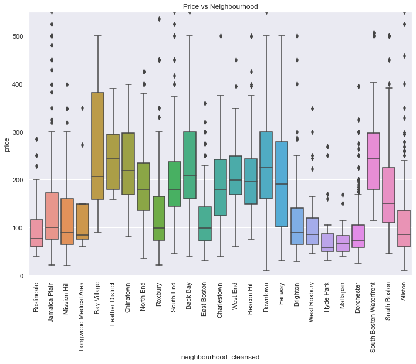

### 1. Business Understanding
Airbnb is an online housing platform that help traveler to connect and book homestays from local hosts while help local hosts earn extra money by listing their available space / room for rent. Airbnb was founded in 2017 by Nathan Blecharczyk, Joe Gebbia and Brian Chesky. Eventhough the free listing offer, they still make money from 2 differents sources after every booking is done which are 10% commission from host and 3% transaction fee from the tranvellers. 

### 2. Data Understanding
#### a. Neighbourhood vs Price

Using the above data, I created a graph with x as actual distance and y as recession velocity.

I was able to notice that more than 70% of the data points rely on the first half of the graph. I decided to use the part of the data that is densly packed together. With the help of Hubble's Law formula, I calculated the age of each galaxy in the data set, I then noticed that the majority of those galaxies' age are around 13 to 14 billion years. From the graph below, I can confidently conclude that our universe is approximately 13 to 14 billion years old. 

Having the age range, I then tried to find a more specific number to represent the universe's age. I then use linear regression to find the slope, which, base on the Hubble's law, is the Hubble constant. 

Since the Big Bang, the universe has expanded by the rate of the Hubble constant. So, in order to turn back time, I needed to take the Hubble constant out of the equation. I can do so by essentially multiplying the Hubble constant by its inverse.

~~~Python
new_hubble_const = model2[0]/(3.08*(1e19))
new_age = 1/(new_hubble_const)
~~~

Using the above code, the result for the age of the universe is in seconds. However, the accepted value is in billions of years. Therefore, to compare them, I needed to convert the seconds into billions of years. At the end of it all, based on the data set and algorithms, the age of the universe is 13.825 billion years. The accepted value for the age of the universe is 13.9 billion years. Therefore with a margin error of 0.5%, I can positively say that I can trust the accepted value.

Check out my work [here](https://colab.research.google.com/drive/1bF9nHEGGYvuFaLh7_4esDXt5HfO8d1yn?authuser=3#scrollTo=IAuq9LhvXRUU)
